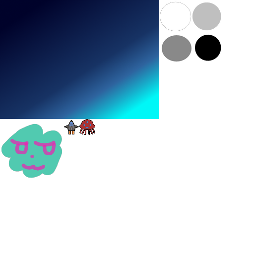

# bi-sheeter
Sprite sheet maker

build: `./scripts/build-macos.rb`

exec: `./build/bin/sheeter path/to/source/dir path/to/output/dir size`

# Example

sprites-0.png, sprites.json and sprites.msgpack files are created via command as:
`./build/bin/sheeter doc/sprites/ doc/ 512 512`



```
{
  "sprites-0.png": [
    [
      "sprites/sky.png", 0, 0, 320, 240
    ],
    [
      "sprites/circles.png", 320, 0, 128, 128
    ],
    [
      "sprites/face01.png", 0, 240, 128, 128
    ],
    [
      "sprites/vehicle.png", 128, 240, 32, 32
    ],
    [
      "sprites/invader.png", 160, 240, 32, 32
    ],
    [
      "sprites/ball.png", 192, 240, 8, 8
    ]
  ]
}
```

# License

[Apache License 2.0](http://www.apache.org/licenses/LICENSE-2.0)
